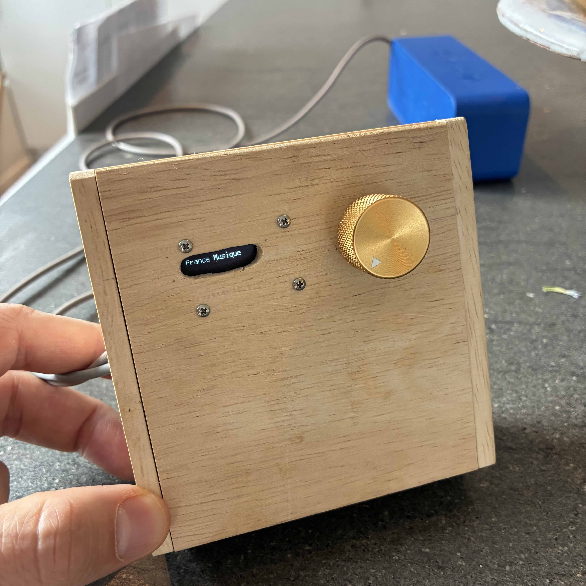
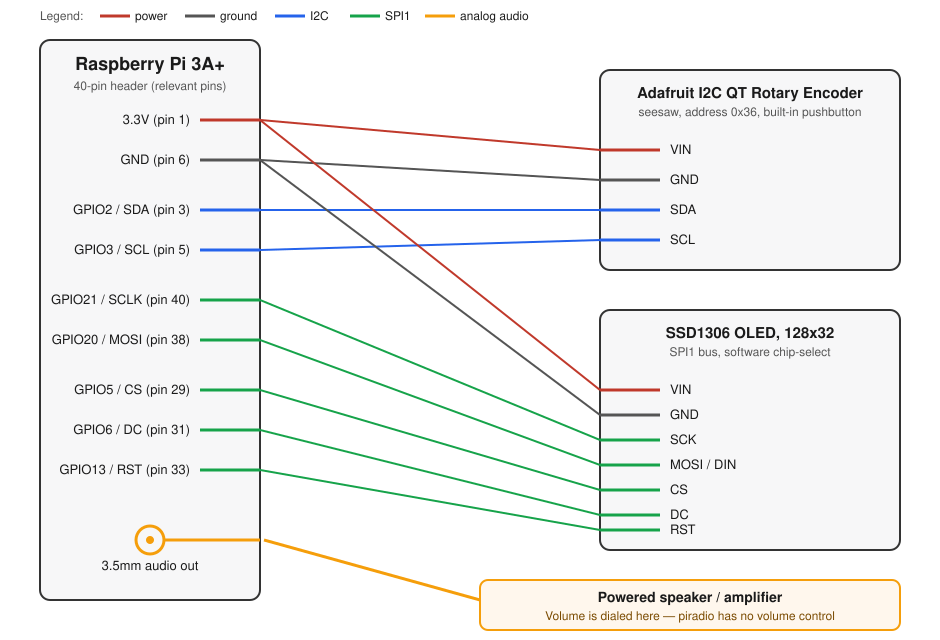

# Physical web radio

I love listening to music, but I don't love being glued to my phone. So I built this physical radio. It plays web radio stations that I like. This version is based on Raspberry Pi, but you can just as well make it with any microcontroller. 



A headless Raspberry Pi internet radio. Turn the rotary encoder's knob to
cycle through a fixed list of internet radio stations; a small OLED screen
shows what's currently playing (or "silence").

**There is no volume control in this project.** The Pi outputs audio at a
fixed level through its 3.5mm analog jack. This is meant to be wired into a
**powered speaker or amplifier that has its own volume knob** — that's where
you control loudness. Turning piradio's rotary encoder only changes which
station plays, not how loud it is.

## Hardware

- Raspberry Pi, headless (built and tested on a Pi 3A+), Raspberry Pi OS Lite (64-bit)
- [Adafruit I2C QT Rotary Encoder](https://www.adafruit.com/product/5880) (seesaw, I2C address `0x36`), used for both station selection and its built-in pushbutton
- A small SPI SSD1306 OLED display, 128x32 (set `HEIGHT` in `piradio.py` if using a 128x64 panel instead)
- A powered speaker or amplifier connected to the Pi's 3.5mm audio jack — **volume lives on that speaker/amp, not here**

## Wiring



| Signal | Pi pin (BCM / physical) | Connects to |
|---|---|---|
| 3.3V | 3.3V (pin 1) | Encoder VIN, OLED VIN |
| GND | GND (pin 6) | Encoder GND, OLED GND |
| I2C SDA | GPIO2 (pin 3) | Encoder SDA |
| I2C SCL | GPIO3 (pin 5) | Encoder SCL |
| SPI1 SCLK | GPIO21 (pin 40) | OLED SCK |
| SPI1 MOSI | GPIO20 (pin 38) | OLED MOSI / DIN |
| Chip select (software) | GPIO5 (pin 29) | OLED CS |
| Data/command | GPIO6 (pin 31) | OLED DC |
| Reset | GPIO13 (pin 33) | OLED RST |
| Audio out | 3.5mm jack | Powered speaker / amplifier (volume knob lives here) |

The OLED is wired to **SPI1**, not the Pi's primary SPI0 bus, so
`/boot/firmware/config.txt` needs `dtoverlay=spi1-1cs` in addition to the
usual `dtparam=spi=on` and `dtparam=i2c_arm=on`. A reboot is required after
changing `config.txt`.

## Software setup

```
sudo apt-get update
sudo apt-get install -y mpg123 python3-venv python3-full git i2c-tools swig liblgpio-dev

python3 -m venv ~/env
~/env/bin/pip install --upgrade pip
~/env/bin/pip install adafruit-blinka adafruit-circuitpython-seesaw \
    adafruit-circuitpython-displayio-ssd1306 adafruit-circuitpython-display-text
```

Playback uses `mpg123` rather than a Python audio library — streaming mp3s
didn't work reliably from Python directly (see Development notes below), so
the script shells out to `mpg123` instead.

## Installing as a daemon

```
sudo cp piradio/piradio.service /etc/systemd/system/
sudo systemctl daemon-reload
sudo systemctl enable piradio.service
sudo systemctl restart piradio.service
```

Check that it works
```systemctl status piradio```

See output
```journalctl -u piradio -f```

## Inspiration
- Adafruit rotary encoder: https://www.adafruit.com/product/5880
- Adafruit code: https://learn.adafruit.com/adafruit-i2c-qt-rotary-encoder/python-circuitpython
- Sparkfun switches: https://www.sparkfun.com/rotary-switch-10-position.html
- Core Electronics guide: https://core-electronics.com.au/guides/getting-started-with-rotary-encoders-examples-with-raspberry-pi-pico/#choosing

## Development notes
- This is how I installed CircuitPi: https://learn.adafruit.com/circuitpython-on-raspberrypi-linux/installing-circuitpython-on-raspberry-pi
- This is what ended up working: https://www.instructables.com/Keeping-It-Stoopid-Simple-Internet-Radio-KISSIR/
Could not get streaming mp3s to play from python directly; this instructs the OS to play it through mpg123.

(note: this was before Claude. Now, just spin out Claude and just ask it, install this).

## Future extensions
### Pico
- Interesting work: https://forums.raspberrypi.com/viewtopic.php?t=381266
- Pico: https://www.raspberrypi.com/products/raspberry-pi-pico/
### Audio cards, power bank...
Potential audio card: 
- https://www.slashgear.com/1403850/how-to-make-smart-speaker-with-raspberry-pi/
- https://www.pishop.us/product/iqaudio-dac-pro/?src=raspberrypi
